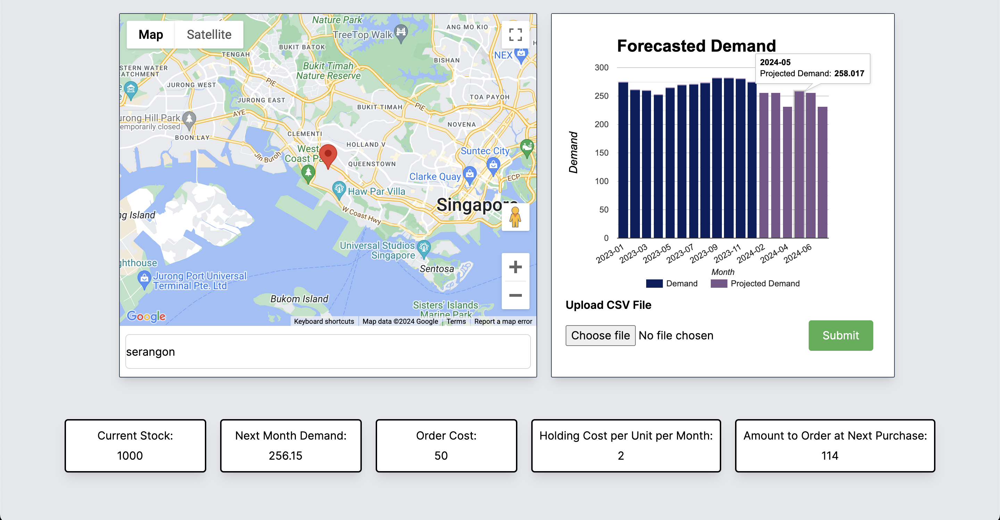
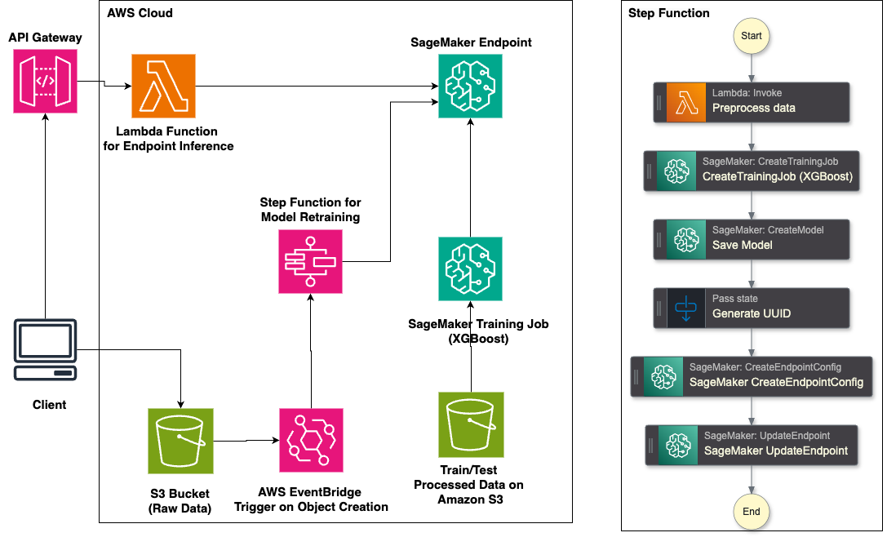

# AI Demand Forecasting Dashboard

_NextJS web application that utilizes AWS Sagemaker for model deployment and retraining (Submission for LifeHack 2024)_

## Try It Out

Website: https://demand-dashboard-deploy-gabriels-projects-04905409.vercel.app/

Devpost link: https://devpost.com/software/bhq-bros

## What It Does

Our dashboard provides:

- **Demand Forecasting**: Predicts future demand using machine learning models that retrain with new data automatically.
- **Route Planning**: Plan delivery routes in advance for efficiency and cost-effectiveness.
- **Inventory Management**: Manages stock levels to prevent overstocking or stockouts, ensuring optimal inventory levels.

## About The Project

In today's fast-paced market, businesses need real-time insights to stay ahead. Supply chain optimisation is essential in the world and it was something that we were unfamiliar with. Therefore, we wanted to dive headfirst into it and learn as much as possible. We were inspired to create a solution that integrates MLOps to help companies make data-driven decisions efficiently.

- Please wait around 30 seconds for the forecasting graph to appear on the website. Do not refresh during this time or the timer will reset.
- Only one person can test the add file function at a time.
- The file uploaded must have the following columns only. 'date' as 'YYYY-mm-dd' and 'units_sold' as a number. An example file can be found in the Github repo with the name milk_consumption.csv

## Usage

### Demand Dashboard Usage

- Upload a CSV file with 2 header columns date, and units_sold, a sample CSV file is provided milk_consumption.csv. Retraining the model takes about 3 minutes, after which the graph will update itself

### Inventory Management Usage

- You can change the values for Current Stock, Order Cost, and Holding Cost per Unit per Month and it will output an Amount to Order at next purchase

## Built With

- Next.JS
- Vercel
- Amazon Web Services

## AWS Infrastructure

